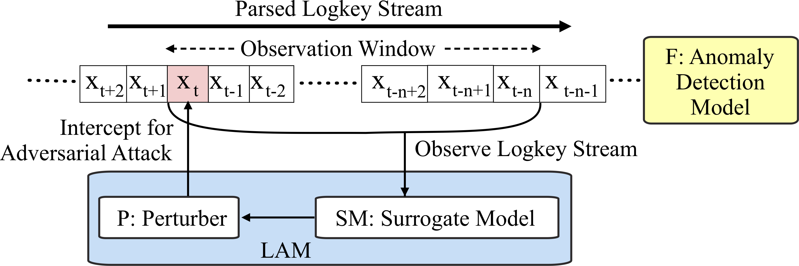

### Real-Time Evasion Attacks against Deep Learning-Based Anomaly Detection from Distributed System Logs

<p align="center">
  
</p>

This repository contains **LAM (Log Anomaly Mask)**, a real-time evasion attack against deep learning based anomaly detection from distributed system logs. Please refer to the [paper](http://www.dinalherath.com/papers/2021codaspy.pdf) for information on algorithms. The code here contains a LAM evasion attack against [DeepLog](https://www.cs.utah.edu/~lifeifei/papers/deeplog.pdf) model for Hadoop File System (HDFS) dataset (i.e., in `data` folder). The main code of our attack is in **LAM.py**. The requirements for the experiments are in `requirements.txt`.

### Running the code

The code can be run by executing `run_LAM_experiments.sh`. The overal experiments have four steps.

1. Train the deep learning based anomaly detection model (e.g., DeepLog)
2. Obtain anomaly detection results before attack.
3. Train the Perturber for LAM attack.
4. Obtain anomaly detection results after attack.

Note that the current code contains pre-trained anomaly detection models and LAM attack models which are stored in folders `models` and `rl_model` respectively. You can turn logging on\off within the code. The logs for the model training will be stored in `logs` and `rl_data` for the anomaly detetcion model and the LAM attack respectively.

### Results

The `results` folder contains the following.

+ A trace for training LAM attack.
+ Anomaly detection results _before_ and _after_ LAM attack.
+ The logs modified after attack stored in `adversarially_modified_logs.txt`

```
@inproceedings{herath2021real,
  title={Real-Time Evasion Attacks against Deep Learning-Based Anomaly Detection from Distributed System Logs},
  author={Herath, J Dinal and Yang, Ping and Yan, Guanhua},
  booktitle={Proceedings of the Eleventh ACM Conference on Data and Application Security and Privacy},
  pages={29--40},
  year={2021}
}
```
